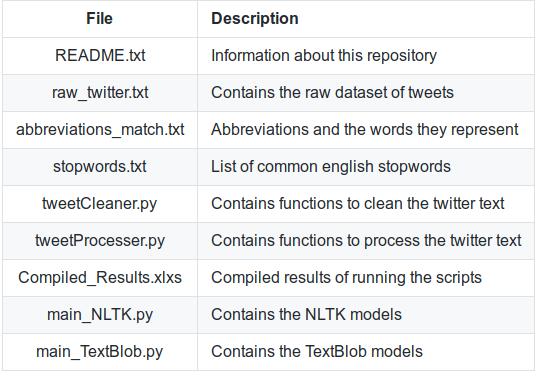
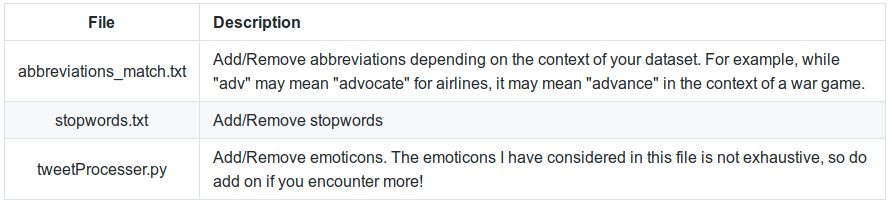

# Twitter-Sentiment-Analysis
### Overview
In this tutorial, we shall perform sentiment analysis on tweets using **TextBlob** and **NLTK**. You may wish to compare the accuracy of your results from the two modules and select the one you prefer. I shall be using the [US airline tweets](https://www.kaggle.com/crowdflower/twitter-airline-sentiment) dataset which can be downloaded from Kaggle. This dataset originates from the *Crowdflower's Data for Everyone library*.

**IMPORTANT:** The sentiment analysis performed here is rather basic and it serves as a starting point for those new to Natural Language Processing. For more accurate industrial applications, I'd recommend checking out [Spacy](https://spacy.io/) or [Apache OpenNLP](https://opennlp.apache.org/).

#### Overview of what each file does:

#### Concepts
At a high level the sentiment analysis will involve 4 steps:
1. Data Assembly
2. Data Processing
3. Data Exploration or Visualization
4. Model Building & Validation

Let's understand the different data preprocessing activities:
  * Convert text to lowercase – Allows us to deal with uniform case text.
  * Remove numbers – Numbers usually do not carry any importance in sentiment analysis
  * Remove punctuation – For bag of words based sentiment analysis punctuation does not add value.
  * Remove stop words – Stop words are common words found in a language and they are mainly neutral.
  * Strip white space – Eliminate extra white spaces.
  * *Stemming* – Transforms to root word. Stemming uses an algorithm that removes common word endings. 
  * Lemmatisation – Transform to dictionary base form i.e., “produce” & “produced” become “produce”
  * *Sparse terms* – We are often not interested in infrequent terms in our documents. Such “sparse” terms should be removed from the document term matrix.

NOTE: Activites in italics were not dealt with in our models.

## Installation
For your convenience, I have attached a *requirements.txt* file containing the modules to install. Simply execute `pip install -r requirements.txt` on your console (after setting the directory path to this project's folder) to install the modules. 

Next, we need to install specific NLTK modules. To do this, open your Python shell and execute `import nltk`. Then, execute `nltk.download()`. The NLTK installer will appear. Select *punkt*, *vader_lexicon* and *wordnet* under "All Packages" and click "Download". Once the download completes, you may close the installer.

## Execution
### Basic
If you are using a different dataset, rename your dataset as "raw_twitter.txt". Ensure that your dataset follows the exact same formatting as the original raw_twitter.txt file.
* For processing using the *NLTK* model, execute *main_NLTK.py*.
* For processing using the *TextBlob* model, execute *main_TextBlob.py*. 

For both models, two output files will be generated. "abbreviations_twitter.txt" shows the tweet texts after extending their abbreviated words. The other file contains the scores and classification of each tweet after running the models. For most intents and purposes, these results will give a fairly accurate indication of the sentiment of each tweet.

### Advanced (optional)
If you'd like to explore improving the accuracy of the above models, then this advanced portion is for you.

#### Changing Cleaning Parameters

#### Testing models at various stages of cleaning
Sometimes, performing excessive cleaning operations on the input may worsen the accuracy of the model. Therefore, I have included several models for testing at the various stages of cleaning. Detailed instructions can be found at the bottom of the *main_NLTK.py* and *main_TextBlob.py* files.

## Conclusion
I hope these models have helped you in your application of sentiment analysis in NLP. If you enjoyed this project, be sure to check out my other [projects](https://thebackyardmoose.com/projects/)! If you have any issues, please feel free to flag it and I'll get back to you as soon as I can. Cheers!

